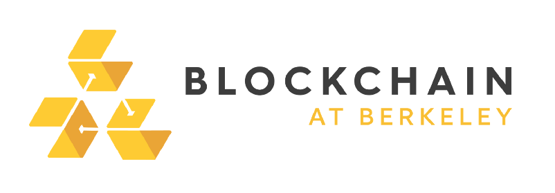

Introduction 
============

After taking Blockchain at Berkeley’s Spring 2017 Introduction to
Cryptocurrencies DeCal, I decided to make a set of notes to reinforce my
learning and also to compile the core ideas of blockchain onto an easily
readable format. Big thanks to the wonderful lecturers, officers, and
other folks at Blockchain at Berkeley for getting me hyped. I have
structured this set of notes after their lecture slides. This set of
notes started off as a personal passion project of mine but has since
garnered the interest of Blockchain at Berkeley executive staff, namely
DeCal lecturer Nadir Akhtar. This project has been a collaborative
effort ever since, and will be provided as complementary material to
future DeCal offerings.

There will be bugs, shaky facts, and some hand-wavy stuff. Be warned! In
any case, if you do find yourself reading this, I hope you enjoy! –
*Rustie Lin*

“how do i get bigger than Bigg but not as big as huge" – *Nadir Akhtar*

***Guidelines for use:***

These notes are based on the Spring 2017 edition of Blockchain at
Berkeley’s “Introduction to Cryptocurrencies and Blockchain" student-run
class. (For any non-Berkeley students: these courses are referred to as
DeCals, short for “Democracy at Cal," exclusively student-run courses.)
Any updates to the course, including but not limited to material or
structure, are not necessarily be reflected within these notes.

-   Each of these notes corresponds to a specific lecture. It may help
    to read the note before going through the lecture, or go through the
    lecture before going through the notes, or use one of the
    two exclusively. We have no clue! You let us know what works best
    for you, we’re curious ourselves!

-   All of the crypto/blockchain material comes from Blockchain
    at Berkeley. Notes will contain about just as much information as
    lectures, profoundly overlapping in information. Again, these notes
    are merely a different way to present the information generated by
    Blockchain at Berkeley. A few tweaks in wording may have been made
    based on our judgment, details may have been added or omitted, but
    all main ideas remain.

-   Every note will end with a page on “Key Terms," composed of any
    bolded terms within the given note. These Key Terms will either be
    important crypto/blockchain terms or terms perhaps unfamiliar to the
    average reader. Terms will be organized alphabetically. While
    reading the Key Terms alone may give you a quick *sense* of the
    content, they will hardly give you an understanding.

-   References to various outside sources are included in a separate
    file from all notes. Any uncited information (almost everything in
    these notes) can be assumed to come from Blockchain at Berkeley. We
    are not validating all information in these notes; responsibility
    for any improper or false information belongs to the source of info.
    Don’t shoot the messenger. One note, definitions for Key Terms are
    rarely word-for-word from Blockchain at Berkeley. (In other words,
    they’re mostly paraphrased or even made from scratch based on
    personal knowledge.)

Key Terms
=========

Below is a working list of commonly used terms and their definitions in
the Blockchain space.

1.  **Bitcoin** — A popular cryptocurrency existing purely as software.
    “Bitcoin" (uppercase) refers to the protocol, software, and
    community; whereas, “bitcoins" (lowercase) refers to the unit
    of currency. It is not backed by any asset or regulated by any
    central entity. (See: *Decentralized, Distributed*)

2.  **Blockchain** — An immutable and distributed database that
    maintains a growing list of records. Blockchains are used to safely
    and securely record transactions between parties. Originally
    designed to make Bitcoin possible.

3.  **Cryptocurrency** — A digital currency in which encryption
    techniques are used to regulate the generation of units and currency
    and verify the transfer of funds, operating independently of a
    central bank.

4.  **Decentralized** — A characteristic that ensures that no single
    entity has control over all the processing in a system.

5.  **Distributed** — A characteristic that ensures that not all the
    processing in a system is done in the same location.

6.  **Trustless** — A characteristic that ensures that a system or
    protocol can function without trusting a single entity. (e.g.
    Everyone has a copy of the Bitcoin ledger/blockchain, so users do
    not have to trust a single entity, organization, or third-party.)

